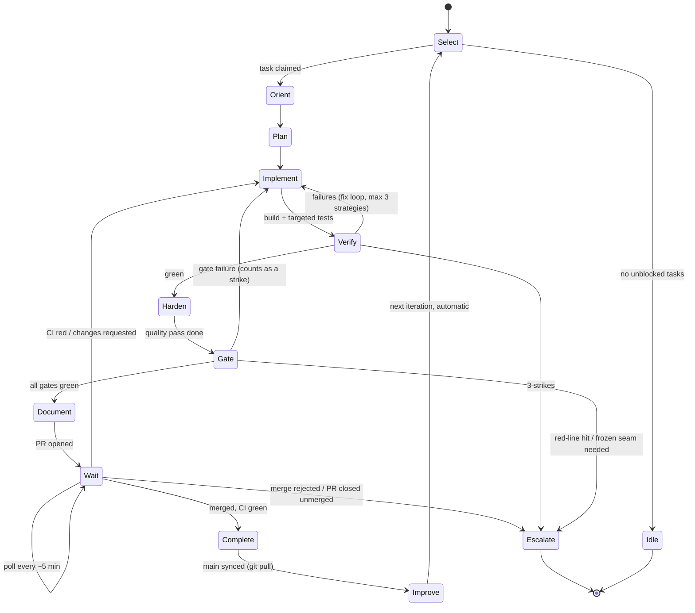

# Autonomous Agent Loop — Vaultform Development Workflow

| | |
|---|---|
| **Version** | 1.0 |
| **Audience** | Claude Code agents executing `tasks/backlog/`; the human operator supervising them |
| **Companion docs** | [CLAUDE.md](../CLAUDE.md) (rules) · [ROADMAP.md](ROADMAP.md) (sequencing) · [tasks/README.md](../tasks/README.md) (workflow) |

This document defines **how agents run continuously**: the per-task loop, the gates that bound it, and the conditions under which an agent stops or escalates. CLAUDE.md defines *what is allowed*; this defines *how work flows*. Where they overlap, CLAUDE.md wins.

---

## 1. The Loop

One iteration = one task, from selection to merge. An agent session runs iterations until a stop condition (§8) fires. **Task-to-task continuation is the default, not something to ask permission for**: once a PR merges and `main` is synced, the agent moves straight to the next SELECT without waiting for a human prompt — this holds across the *whole* backlog, not just one task, unless a §8 Stop Condition or §9 Escalation actually fires. The only things that pause the loop are: the §8 Stop Conditions, the §9 Escalation table, Step 8a's review-required carve-out (`[INTEGRATION]`/security-touching/API-schema PRs, or anything touching `CLAUDE.md`/this file), and Step 8a's own 5-attempt CI-fix-and-retry-merge cap. Ordinary merge waiting is not one of them (see Step 8a/8b).



### Step 0 — SELECT (task acquisition)
1. Refresh `main`; scan `tasks/in-progress/` to see what other agents hold (their primary packages are off-limits).
2. From `tasks/backlog/<earliest-incomplete-phase>/`, pick the highest-priority task whose **dependencies are all in `done/`** and whose **primary package is unclaimed**. Priority order: Critical → High → Medium; ties broken by unblocking power (how many backlog tasks list it as a dependency).
3. Claim atomically: move the task file to `in-progress/`, add `**Owner:** <agent-id> · **Branch:** task/<ID>-<slug> · **Claimed:** <commit-sha of main>`, commit that move to `main` immediately (this is the lock; if the push conflicts, someone else claimed it — reselect).
4. Branch `task/<ID>-<slug>` from fresh `main`.

### Step 1 — ORIENT (bounded context load; read in this order, stop when sufficient)
1. Root `CLAUDE.md` (always — it's the contract).
2. The task file (goal, requirements, acceptance criteria are the spec; do not re-derive scope from the PRD).
3. The primary package's `CLAUDE.md` + its `Tests/` directory listing.
4. **Only** the doc sections the task's Background cites (e.g. "ARCHITECTURE.md §5.2") — not the whole document.
5. **Only** the source files the task lists under "Files Likely Affected," plus files your search identifies as direct consumers of what you'll change.

**Context discipline rules:** never read the whole repo, whole docs, or other packages' sources "for background." If understanding requires a file outside the primary package, read its `*API` package instead — if the API is insufficient to understand the contract, that's a documentation defect: note it for Step 7. Record what you read in a `## Journal` section appended to the in-progress task file (this makes handoffs and post-mortems cheap).

### Step 2 — PLAN
- Write a 5–10 line plan into the Journal: files to touch, test strategy, risks, and which acceptance criterion each change serves.
- Check the plan against CLAUDE.md §3 (architecture rules) *before* writing code: does anything need a frozen seam changed, a new dependency, a new entitlement? If yes → **Escalate now** (§9), not after implementation.

### Step 3 — IMPLEMENT
- Test-first for logic with crisp contracts (PolicyKit rules, formatters, parsers, state machines); test-alongside for UI and adapters.
- Small commits, conventional format, each leaving the package compiling.
- Follow CLAUDE.md §4/§5 standards and §20 rules for modifying existing code. When you find adjacent defects outside scope: fix trivial ones in a separate commit if inside the primary package; otherwise file them (§10).

### Step 4 — VERIFY (targeted, then widening)
1. `Scripts/verify.sh <PrimaryPackage>` — build, package tests, boundary lint.
2. If the task touches a benched path: `Scripts/bench.sh <relevant-suite>` and compare to baseline.
3. If the task mutates PDFs: `Scripts/corpus-roundtrip.sh --sample` (full suite runs in CI).
4. Run consumer-package test suites for any `[INTEGRATION]` task.

**Fix loop:** on failure, diagnose → fix → re-verify. A "strike" = one abandoned fix *strategy* (not one failing run). After **3 strikes** on the same failure, stop and escalate with the Journal (§9). Never weaken a test, loosen an assertion, skip a gate, or mark a bench "flaky" to get green — that is a red-line violation, not a fix.

### Step 5 — HARDEN (quality pass on your own diff)
Re-read the full diff as a hostile reviewer using CLAUDE.md §14, then:
- Delete dead code, debug scaffolding, commented-out blocks, narrating comments.
- Check error paths you added actually surface (force each error in a test).
- Simplify: any abstraction serving only one call site gets inlined; any duplication of an existing utility gets replaced with the utility.
- Run the security/privacy self-audit (§4 below) and record its one-line result in the Journal.

### Step 6 — GATE (must all pass before PR; see §3–§6)
G1 mechanical + G2 security + G3 performance + G4 architecture, as applicable to the diff.

### Step 7 — DOCUMENT
- Update the package `CLAUDE.md` if invariants/usage changed (same PR).
- Update any spec the task's "Documentation Updates" section names.
- Fix the documentation defects you logged in Step 1 (API docs that were insufficient) — in this PR if in-package, else file a task.
- PR description: paste the CLAUDE.md §13 checklist, filled honestly; link the task file; include evidence per acceptance criterion (test names, bench numbers, screenshots).

### Step 8 — COMPLETE

**8a — Poll CI, then merge if eligible.** Rebase on `main`, re-run `verify.sh` post-rebase, open (or update) the PR with the CLAUDE.md §13 checklist filled in. This repo has **no platform-enforced branch protection** (GitHub Free doesn't allow it on private repos — `tasks/escalations/E-003-branch-protection-needs-paid-plan.md`), so nothing on GitHub's side stops a premature merge; the agent's own check of `ci-status` *is* the gate. Poll on a **~5 minute cadence** (don't busy-loop), checking `gh pr checks <n>` (or equivalent) each time:
  - **`ci-status` green, and the PR is *not* `[INTEGRATION]`/security-touching/`*API`/`Schemas/`, and it doesn't change `CLAUDE.md` or this file:** merge it now, autonomously. This is standing authorization for every ordinary PR, not a one-off ask — go to 8c immediately after.
  - **`ci-status` green, but the PR *is* `[INTEGRATION]`/security-touching/`*API`/`Schemas/`, or it changes `CLAUDE.md` or `docs/AGENT_LOOP.md`:** do not merge regardless of CI. The latter two are a fourth review-required category on top of CLAUDE.md §21's three, per §10's "improvement rule" below — process/governance docs review themselves, they don't get to except themselves. Request human review explicitly and proceed to 8b.
  - **`ci-status` red, or a merge conflict:** never merge on red. Return to Step 4/6, diagnose, fix, re-push, and re-enter 8a's poll. **This fix-and-retry-merge cycle is capped at 5 attempts** for a given PR — a distinct, tighter counter than Step 4's 3-strike local-verify rule (that one governs the pre-PR build/test loop; this one governs the post-PR "is it mergeable yet" loop, and can span several Step-4/6 excursions before it's exhausted). Attempt 1 is the first red result; each subsequent fix-push-recheck is another attempt. If the 5th attempt is still red: stop, leave the PR open and untouched, write a Journal entry covering what was tried across all 5 attempts and the remaining hypothesis, and wait for human review — do not attempt a 6th time, and do not move on to another backlog task while this PR sits unresolved (that would leave a broken PR unattended, which is worse than pausing). If any attempt resolves it and `ci-status` goes green, re-evaluate the merge-eligibility bullet above immediately — don't keep fixing past green.
  - **PR closed without merging (by a human, e.g. rejecting the change):** stop and escalate (§9) immediately — a human decision was made against the change; don't reopen it, don't retry silently, don't reinterpret it.

**8b — Wait for human review (review-required PRs only).** Only reached for `[INTEGRATION]`/security-touching/`*API`/`Schemas/` PRs. Poll on the same ~5 minute cadence for the review decision:
  - **Approved and merged:** go to 8c.
  - **Still awaiting review:** wait another ~5 minutes and re-check. There is no timeout — it waits as long as it takes; that wait is not idle time and is not a stop condition.
  - **Changes requested:** address them (Step 4/6), then back to 8a's CI poll before requesting review again.
  - **Rejected or closed unmerged:** stop and escalate (§9) immediately, same as 8a's last bullet.

**8c — Sync.** Once merged: `git checkout main && git pull` (fast-forward only). If the pull isn't a clean fast-forward, something raced with another agent or a direct push — stop and investigate before continuing; don't force or rebase past it. This synced `main` is what the next iteration's Step 0 SELECT reads from.

**8d — Housekeeping.** On top of the freshly-pulled `main`: move the task file to `done/` (keep the Journal in it), commit. If this task was a milestone's last open item: run the milestone exit-criteria checklist from ROADMAP.md and write `docs/specs/<milestone>-report.md`; milestone reports are **always** escalated to the human for go/no-go (§9) — this is the one event in COMPLETE that does stop the loop.

### Step 9 — IMPROVE, then loop
Run the continuous-improvement checklist (§10, ~5 minutes), then return to Step 0 **automatically** — no human prompt needed; this transition is the default behavior of the loop, not an exception to it. Start the next iteration with **fresh context** — do not carry the previous task's files in working memory; re-orient from scratch. Long-running agent sessions accumulate stale assumptions; the loop is designed so each iteration is self-contained.

---

## 2. Multi-Agent Concurrency

- The `in-progress/` claim commit is the mutex; primary-package disjointness is the isolation guarantee. Never work on a package another in-progress task owns.
- `[INTEGRATION]` tasks are exclusive over every package they list: claim only when none are held, and hold blocks others until merge.
- Shared surfaces (`App/`, `Packages/*API/`, `Schemas/`, root docs) are serialized by the same rule — they are the listed primary/integration surfaces of exactly one in-progress task at a time.
- Rebase-before-merge is mandatory; if a rebase conflicts outside your primary package, something violated isolation — stop and escalate rather than resolving blind.
- Stale claims: a task in `in-progress/` whose branch has no commits newer than 100 merged PRs to main may be reclaimed; append a takeover note to its Journal and start from its last green state.

## 3. Quality Gates (G1 — mechanical, every PR)

| Check | Tool | Blocking? |
|---|---|---|
| Package build + tests | `verify.sh` | Yes |
| Import-boundary lint | `verify.sh` | Yes |
| SwiftLint, format | CI repo-wide job | Yes |
| Codegen drift (`Schemas/` ↔ generated) | `codegen.sh --check` | Yes |
| Fixture PII/secret scan | CI | Yes |
| Diff scope = primary package (or `[INTEGRATION]`) | CI path check | Yes |
| Conventional commit + task link | CI | Yes |
| New/changed public API has doc comments | lint rule | Yes |
| Test delta: behavior-changing diff includes test changes | CI heuristic + reviewer | Yes (override requires stated reason in PR) |

## 4. Security Checks (G2 — on every PR; deep checks when triggered)

**Always (automated + self-audit):**
- Red-line grep suite in CI: network APIs outside the allowlisted modules; `print(`/console logging of typed value wrappers; `String(` bridging of `SecureBytes`; `try!`/`fatalError` in product code; `/tmp` paths; JS-evaluation APIs.
- Self-audit sentence in PR (CLAUDE.md §13): what sensitive data does this code touch, and how is it protected.

**Triggered when the diff touches vault, policy, crypto, XPC surfaces, entitlements, or parsers of untrusted input:**
- Negative-path tests present (ticket-less call, locked vault, tampered input, replay).
- Entitlement diff check: any change to entitlements/Info.plist permissions **auto-escalates** to human review — an agent may never self-approve one.
- Parser changes add malformed-input fixtures and run under the fuzz seed set.
- Threat-model delta: one Journal paragraph mapping the change to ARCHITECTURE.md §6.1 rows.

**Standing security tasks (self-scheduling, see §10):** dependency-advisory scan on every PDFium/SQLCipher/Sparkle version bump; quarterly-equivalent (every ~200 merged PRs) red-line grep audit of the whole tree, filed as a Medium task.

## 5. Performance Checks (G3 — when the diff is on a benched path)

- Run the owning bench suite; compare against the trend baseline stored by `bench.yml`.
- **Regression policy:** >5% regression on any NFR-P budget metric blocks the PR that caused it. The fix is either in the same PR or the PR doesn't merge — no "optimize later" merges on budget metrics.
- New hot paths (per-tile, per-frame, per-field loops) require a micro-bench case added in the same PR, so the *next* agent's regression is catchable.
- Accuracy metrics (NFR-A1–A4) are performance for this product: matcher/OCR/extractor changes must show bench deltas in the PR body; unexplained accuracy *improvements* get a Journal note too (they often mean the benchmark got easier, not the model better — check fixture drift).

## 6. Architecture Review (G4)

**Continuous (every PR, automated):** boundary lint; frozen-seam path protection (`Packages/*API/`, `Schemas/` changes fail CI without an ADR file in the diff and human review requested); layering direction checks.

**Judgment layer (agent self-review, Step 5):** answer in the Journal —
1. Did I add any type that duplicates a concept in an API package?
2. Did I put logic in a layer that will need it moved later (UI logic in views, policy in sessions)?
3. Would ARCHITECTURE.md need editing to stay truthful about my change? (If yes and the task didn't say so → escalate; the code may be right and the architecture doc wrong, but that's a human's call.)

**Periodic (standing task, every ~50 merged PRs):** an **architecture drift review** task — one agent reads the diff-of-diffs (merged PR titles + API package git log), checks module dependency graph against ARCHITECTURE.md §3.1, and files either "no drift" or corrective tasks. Drift found twice in the same package triggers a human-reviewed ADR discussion.

## 7. Testing Workflow

1. **Contract tests live in API packages** (conformance suites); implementations must pass them unmodified. If an implementation "needs" the suite changed, that's a contract change → ADR path.
2. **Fixture-first regressions:** every bug fixed adds a manifest row or fixture *before* the fix commit, demonstrating the failure; the fix commit turns it green. No fix merges without its regression case.
3. **Test taxonomy per diff type:** pure logic → unit + property tests; state machines → transition-matrix tests; XPC surfaces → conformance + crash/recovery tests; UI → view-model tests + snapshot + targeted XCUITest; benched paths → bench delta.
4. **Flake policy:** a flaky test is a Sev-2 defect in the test, fixed or quarantined-with-task within the same session it's observed; quarantine without a filed task is a red-line violation.
5. **Coverage stance:** no numeric coverage gate (it invites gaming); instead the reviewer question is *"would these tests catch the plausible bug this diff could introduce?"* — answer it explicitly in the PR body.

## 8. Stop Conditions (halt the loop; do not start a new iteration)

1. **No unblocked tasks** in the current phase whose primary package is free → post an idle report (what's blocked and on what) and stop.
2. **Milestone boundary reached** → milestone report written → stop for human go/no-go.
3. **Red-line breach detected** (yours or pre-existing): anything in CLAUDE.md §7/§8 — stop feature work, fix or file as Sev-1, and stop the loop if the breach is in merged code.
4. **Repeated gate failure:** 3 strikes on one failure, or the same gate failing across 2 consecutive tasks (suggests infrastructure rot, not task difficulty).
5. **Main is red:** never branch new work off a failing main; the only valid task is fixing main.
6. **Frozen-seam necessity:** the task cannot be completed without changing an API package, schema, entitlement, or root doc → escalate, don't improvise.
7. **Anomaly of understanding:** the codebase materially contradicts CLAUDE.md/ARCHITECTURE.md (e.g., a vault call path without tickets) → assume you're missing context; stop and escalate rather than "fixing" either side.

Note: waiting on CI or a human review (Step 8a/8b's ~5-minute poll cadence) is normal loop operation, not condition 1 — an agent parked in 8a/8b has an unblocked task in flight, it just isn't merged yet. Only escalate out per those steps' own rules (merge rejected, or Step 8a's 5-attempt CI-fix-and-retry-merge cap exhausted).

On any stop: leave the task file in `in-progress/` with a Journal entry stating exactly where things stand and what the next agent (or human) needs to decide.

## 9. Escalation Conditions (human decision required; loop may continue on *other* tasks unless §8 also applies)

| Trigger | What the agent provides |
|---|---|
| Frozen-seam change needed | Draft ADR: problem, options, recommendation, blast radius |
| Acceptance criteria ambiguous/contradictory | The specific ambiguity + the interpretation it would pick and why |
| 3-strike failure (Step 4, pre-PR) or 5-attempt exhaustion (Step 8a, post-PR CI-fix-and-retry-merge) | Journal: strategies tried, hypotheses remaining, minimal repro |
| Security finding (any severity) or entitlement change | Sev-classified report; for Sev-1, also a stop |
| ADR-001-class decision gates (e.g., P2-14 memo) | Evidence memo with a recommendation, never a unilateral pivot |
| Milestone go/no-go | Exit-criteria report with pass/fail per criterion |
| Bench regression with no in-PR fix found | Profile data + options (accept scope cut vs. defer task) |
| Anything requiring spending money, external accounts, publishing, or real-world data acquisition | Request with exact need (e.g., corpus form licensing — the known human dependency) |
| Two tasks want the same design decision differently | Both task IDs + the conflict, so the human amends one task |

Escalations are filed as `tasks/escalations/<ID>-<slug>.md` (create the folder on first use) and referenced from the Journal. Escalate **early and small**: a two-line question before implementation beats a 400-line PR built on a guess.

## 10. Continuous Improvement Workflow

**Per-iteration (Step 9, cheap):**
- File tasks for defects/debt noticed but out of scope (use `_TEMPLATE.md`, Complexity S, honest priority) — the backlog is the memory; Journals are not searchable intent.
- If any instruction in CLAUDE.md or a package CLAUDE.md was wrong/ambiguous *and it cost you time*, file a doc-fix task (root CLAUDE.md fixes always route to human review per its own rules).
- Append one line to `docs/specs/loop-metrics.md`: task ID, iterations of the fix loop used, gates failed, context files read. This is the loop's own telemetry.

**Standing cadence tasks (self-scheduling: when the trigger count is reached, the next idle agent files and runs them):**
| Cadence | Task |
|---|---|
| Every ~50 merged PRs | Architecture drift review (§6); backlog grooming (re-verify dependencies, split any task that took >2 sessions, promote unblocking tasks) |
| Every ~100 merged PRs | Loop retrospective: read `loop-metrics.md`, identify the top friction (slowest gate, most-failed check, most-read-but-useless doc), file one fix task for it |
| Every ~200 merged PRs | Repo-wide red-line audit (§4); fixture corpus growth review against corpus-plan; package CLAUDE.md freshness sweep (each ≤60 lines, invariants still true) |
| Each phase boundary | Prune `done/` Journals into `docs/specs/phase-<n>-lessons.md` (what future agents should know), then update this document if the loop itself needs changing (human-reviewed) |

**The improvement rule:** improvements to the *process* (this file, CI, scripts, templates) are made through the same task/PR machinery as product code — an agent that "just starts doing it differently" creates divergence between documented and actual process, which is the failure mode this whole system exists to prevent.

---

## Appendix — Iteration Preflight Card (the 10-second checklist before Step 3)

```
□ Task claimed via in-progress/ move, committed to main
□ Dependencies verified in done/          □ Primary package unclaimed by others
□ CLAUDE.md + package CLAUDE.md read      □ Cited doc sections only — no repo tourism
□ Plan in Journal, mapped to acceptance criteria
□ No frozen seam / entitlement / new dependency needed (else escalate NOW)
□ main is green
```
