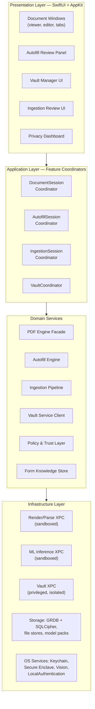
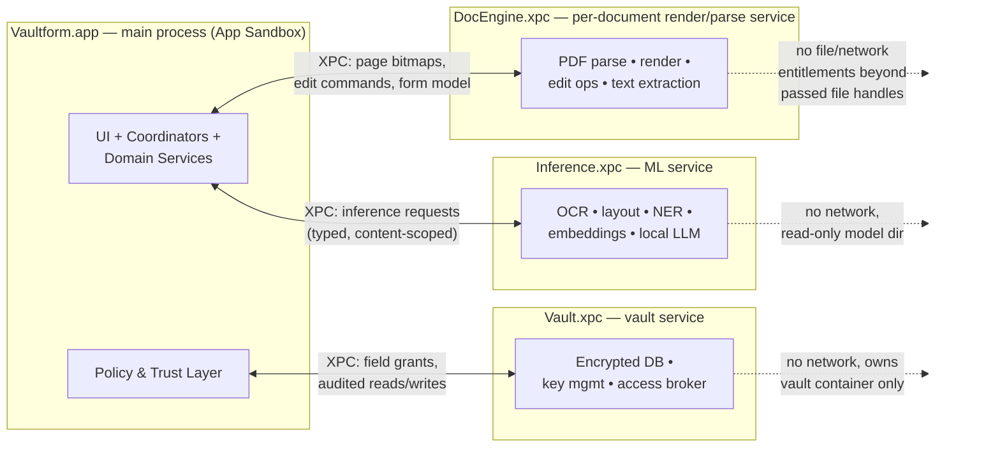
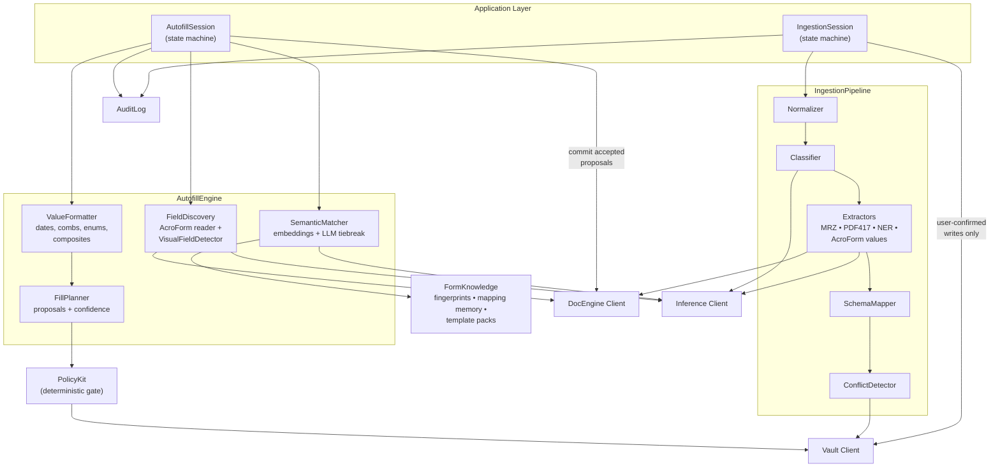
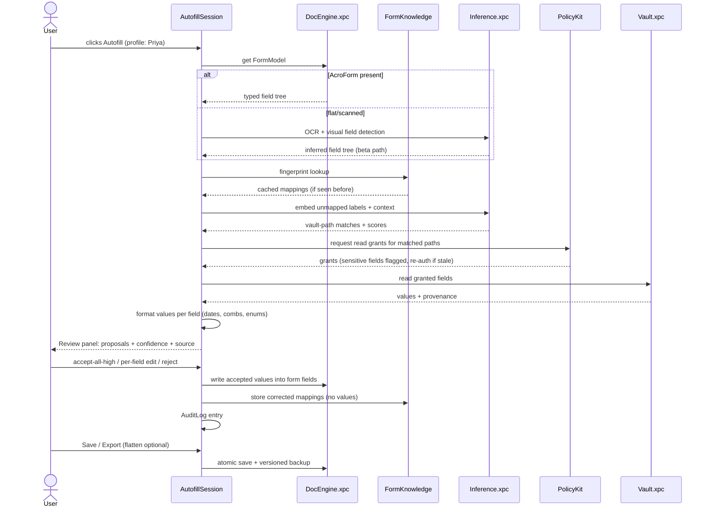
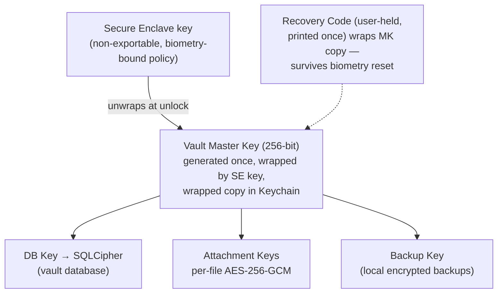
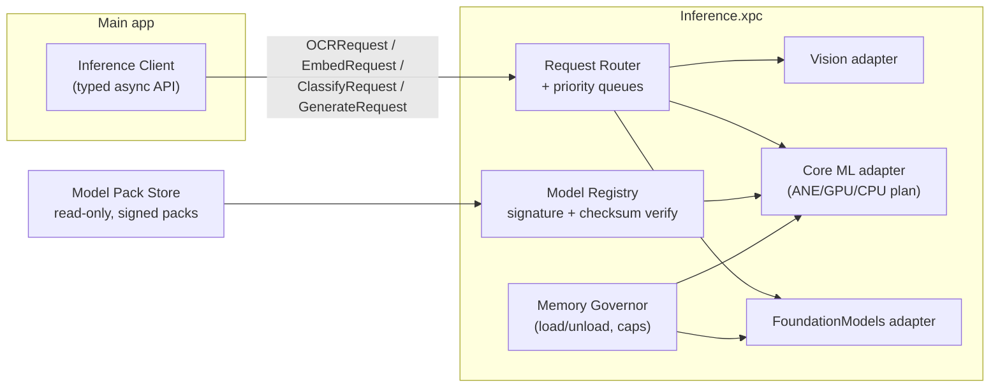

# Software Architecture Document

## Vaultform — Native macOS PDF Editor with Privacy-First AI Autofill

| | |
|---|---|
| **Version** | 1.0 (Draft) |
| **Date** | July 3, 2026 |
| **Companion doc** | [PRD.md](PRD.md) |
| **Status** | For review |

---

## 1. Architectural Drivers (from the PRD)

The PRD imposes five constraints that dominate every design decision below:

1. **Local-first is load-bearing, not aspirational** (FR-5.1, NFR-S1–S4). No core feature may require a network. Architecture must make the "zero network" claim *auditable*.
2. **Untrusted input everywhere.** PDFs are the most-exploited document format in history; ingestion accepts arbitrary user files. Parsing must be isolated from the vault.
3. **The vault is a honeypot** (Risk R4). Its blast radius must be minimized architecturally — encryption, process isolation, and mediated access, not just careful code.
4. **AI proposes, policy disposes** (FR-4.4, NFR-A4). Model outputs must pass through a deterministic policy layer; no model output writes to a document or the vault directly.
5. **Never corrupt a document** (NFR-R2). All document mutation goes through a transactional, versioned save path.

Plus two softer drivers: native macOS feel (SwiftUI/AppKit, NFR-P*), and an engine strategy that survives Risk R1 (PDF complexity).

---

## 2. High-Level Architecture

### 2.1 Style

A **layered, service-oriented monolith split across sandboxed processes**. One app bundle; multiple OS processes connected by XPC. Within each process, strict layering with protocol-boundary dependency injection. This is the macOS-native analog of what Chrome/Preview do for untrusted content: crashes and exploits in a parser cannot touch vault memory.

### 2.2 Layer view



**Layer rules (enforced by module boundaries / SPM targets):**
- Presentation depends only on Application (view models + coordinator protocols).
- Application orchestrates Domain services; owns undo/session state; never touches Infrastructure directly.
- Domain services are pure Swift, UI-free, and testable headless; they speak to Infrastructure through protocols.
- Infrastructure is the only layer allowed to import GRDB, Core ML, PDF engine internals, XPC.

### 2.3 Process topology



**Why three services, not one:**

| Process | Trust posture | Entitlements | Crash blast radius |
|---|---|---|---|
| `DocEngine.xpc` | **Hostile input.** Parses arbitrary PDFs/DOCX/images. | No network, no vault container; receives security-scoped file handles only. One instance *per open document* so a malformed file kills only its own window. | Lost render of one document; auto-restart. |
| `Inference.xpc` | Semi-trusted; processes extracted content. | No network; read-only access to model directory; memory-capped. | In-flight inference retried. |
| `Vault.xpc` | **Most privileged.** Sole owner of vault DB and keys. | No network; exclusive access to vault container; talks *only* to the main app's Policy layer. | Vault relocks; DB is transactional. |

The main app never links the PDF parser or holds vault plaintext in bulk — it holds only the specific decrypted field values granted per operation.

---

## 3. Low-Level Architecture & Module Responsibilities

### 3.1 Module map (SPM package layout)

```
Vaultform/
├── App/                     # app target, DI composition root, windows/menus
├── Features/                # Application layer
│   ├── DocumentSession/     # open/edit/save lifecycle, undo stack, tabs
│   ├── AutofillSession/     # fill workflow state machine + review model
│   ├── IngestionSession/    # ingestion workflow state machine + review model
│   ├── VaultManager/        # profile CRUD flows, lock state UX
│   └── PrivacyDashboard/
├── Domain/
│   ├── PDFEngineAPI/        # engine-agnostic protocols: Render, Edit, Forms, Annotate
│   ├── AutofillEngine/      # field detection orchestration, matching, formatting
│   ├── IngestionPipeline/   # stage graph, extractors, conflict detection
│   ├── VaultModel/          # profile schema, field types, sensitivity tiers
│   ├── PolicyKit/           # confidence thresholds, sensitive gating, consent rules
│   └── FormKnowledge/       # form fingerprints, mapping memory, template packs
├── Infra/
│   ├── DocEngineHost/       # XPC client + engine adapter (PDFium wrapper)
│   ├── InferenceHost/       # XPC client + Core ML / FoundationModels adapters
│   ├── VaultStore/          # XPC client; service side: GRDB+SQLCipher, keys
│   ├── AuditLog/            # append-only local log
│   └── Platform/            # Keychain, LAContext, file coordination, Spotlight
└── Services/                # the three .xpc targets
```

### 3.2 Module responsibilities

| Module | Owns | Must never |
|---|---|---|
| **DocumentSession** | Document lifecycle: open → edit → atomic save → versioned backup; undo/redo stack; dirty state; recovery journal. | Perform PDF byte manipulation itself (delegates to engine). |
| **PDFEngineAPI** | Engine-neutral protocols: `PageRenderer`, `TextEditor`, `PageOrganizer`, `AnnotationStore`, `FormModel` (typed field tree: name, rect, kind, format, tooltip, tab order). | Leak engine-specific types upward. |
| **DocEngineHost / DocEngine.xpc** | PDFium wrapper: incremental parse, tiled rendering, content-stream editing, annotation serialization, AcroForm read/write, save with incremental-update or full rewrite. | Touch the network, the vault, or files it wasn't handed. |
| **IngestionPipeline** | Stage graph per §5.1: normalize → OCR → classify → extract → map → conflict-detect. Emits `ExtractionCandidate[]` — never writes to vault. | Persist anything without a user-confirmed review result. |
| **AutofillEngine** | Field discovery (AcroForm path + visual path), semantic matching, value formatting, fill plan construction (`FillPlan = [FieldProposal]`). | Write into the document; only `AutofillSession` commits accepted proposals via the engine. |
| **PolicyKit** | Deterministic rules: confidence thresholds, sensitivity gating, re-auth triggers, ephemeral-mode enforcement, cloud-consent gate (future). Pure functions over typed inputs — unit-testable, no ML. | Be bypassed: engine and vault APIs *require* a `PolicyTicket` on privileged calls. |
| **VaultModel** | Profile schema (persons, org, sections, fields, history lists, relationships), field provenance, sensitivity tiers. | Contain storage or crypto code. |
| **VaultStore / Vault.xpc** | SQLCipher DB, key hierarchy, lock state, CRUD with audited access, crypto-shred, backup/restore. | Return bulk plaintext dumps; every read is field-scoped and logged. |
| **InferenceHost / Inference.xpc** | Model registry, model-pack lifecycle, typed inference endpoints (OCR, classify, NER, embed, layout, generate), hardware-tier selection, batching, memory caps. | Load unchecksummed models; make network calls. |
| **FormKnowledge** | Form fingerprinting (structure hash + fuzzy layout similarity), per-form mapping memory from user corrections, bundled template packs for top forms. | Store *values* — mappings only (field ↔ vault-path + format), per FR-4.8. |
| **AuditLog** | Append-only, local, user-readable log of ingestions, fills, vault access, network events (should be: none). Backs the Privacy Dashboard. | Log field *values* — references and hashes only. |

### 3.3 Communication between modules

**Within a process** — three mechanisms, chosen by coupling type:

1. **Direct async calls via protocol injection** for request/response (coordinator → domain service). Swift structured concurrency (`async/await`, actors); domain services that hold mutable state are actors.
2. **Domain event bus** (typed `AsyncSequence`-based publisher) for cross-feature facts: `VaultDidLock`, `DocumentSaved`, `FillCommitted`, `ProfileFieldChanged`. Consumers: Privacy Dashboard, AuditLog, FormKnowledge learning. Events carry IDs, never values.
3. **Session state machines** for the two long-running workflows (ingestion review, autofill review) — explicit states so the UI, cancellation, and crash recovery are tractable.

**Across processes (XPC)** — typed, versioned, capability-scoped:

- Interfaces defined as Swift protocols with `Codable` DTOs; no `NSSecureCoding` custom classes beyond the boundary.
- **Capability handshake:** the main app passes security-scoped file handles to `DocEngine.xpc` (the service has no filesystem entitlement of its own); `Vault.xpc` accepts only requests accompanied by a `PolicyTicket` minted by PolicyKit (a signed, short-lived, operation-scoped token: e.g., "read fields {passport.number} for fill-session S").
- Bulk pixel data (rendered tiles) via `IOSurface` shared memory; everything else small typed messages.
- All XPC APIs versioned from day 1 (`v1` suffix) — services and app update atomically in one bundle, but this keeps crash-recovery mismatch handling sane.

---

## 4. Component Diagram — Autofill & Ingestion Core



Key structural facts encoded above:
- **Nothing writes to the vault except a session acting on explicit user confirmation**, and even then through PolicyKit → Vault client.
- **Nothing writes to the document except AutofillSession committing accepted proposals** through the engine.
- SemanticMatcher consults FormKnowledge *before* ML: fingerprint hit → deterministic mapping, models only fill the gaps. This is both a quality floor (Risk R2 fallback) and a speed win.

---

## 5. Data Flow

### 5.1 Ingestion flow (document → vault)

```mermaid
sequenceDiagram
    actor U as User
    participant IS as IngestionSession
    participant DE as DocEngine.xpc
    participant ML as Inference.xpc
    participant PK as PolicyKit
    participant V as Vault.xpc

    U->>IS: drops passport.pdf
    IS->>DE: parse + rasterize (scoped file handle)
    DE-->>IS: page images + native text (if any)
    IS->>ML: OCR pages (if scanned)
    ML-->>IS: text + geometry
    IS->>ML: classify document
    ML-->>IS: type = passport (0.97)
    IS->>ML: run extractors (MRZ parse + NER)
    ML-->>IS: ExtractionCandidates (value, region, confidence)
    IS->>V: read existing values (compare-only grant)
    V-->>IS: current field summaries
    IS->>IS: conflict detection
    IS-->>U: Review UI: candidates + source snippets
    U->>IS: accept / edit / reject each
    IS->>PK: request write grant (accepted set)
    PK->>V: write fields + provenance (PolicyTicket)
    V-->>PK: committed (tx)
    IS->>IS: append AuditLog entry (IDs only)
    Note over IS,V: Ephemeral mode: skip write path entirely;<br/>candidates live only in session memory
```

### 5.2 Autofill flow (vault → form)



### 5.3 Data lifecycle summary

| Data | Created by | Lives in | Leaves device? |
|---|---|---|---|
| Profile fields + provenance | Ingestion/manual entry | Vault DB (SQLCipher) | Never (export = user-initiated file) |
| Original ingested documents | User opt-in per document | Encrypted attachment store | Never |
| Form fingerprints + mappings | Autofill corrections | FormKnowledge DB (no values) | Never |
| Rendered tiles, OCR text | Per session | Process memory / encrypted temp, purged on close | Never |
| Audit log | All privileged ops | Append-only local file (IDs/hashes) | Never |
| Opt-in telemetry | Aggregation job | Content-free counters | Only if user opts in |

---

## 6. Security Architecture

### 6.1 Threat model (summary)

| Threat | In scope? | Primary control |
|---|---|---|
| Malicious PDF exploiting parser | Yes | DocEngine process isolation, no entitlements, per-document instance |
| Stolen Mac, powered off | Yes | FileVault + vault encryption at rest; keys in Secure Enclave |
| Stolen Mac, logged in, vault locked | Yes | Vault key unwrap requires LAContext (Touch ID/password); auto-lock |
| Malware reading vault DB file | Yes | SQLCipher — file is ciphertext without SE-wrapped key |
| Malware with same-user code execution + memory scraping | Partially | Minimized plaintext window (field-scoped grants, zeroization); honestly documented as residual risk |
| Our own code exfiltrating data | Yes (trust product) | No-network services, network events audited/surfaced, third-party audit, direct-build reproducibility notes |
| Shoulder surfing / UI leakage | Yes | Sensitive-tier masking, transient pasteboard, screenshot-excluded vault windows |
| Compromised model pack | Yes | Signed + checksummed packs; Inference.xpc refuses unverified models |

### 6.2 Key hierarchy



- **Unlock:** `LAContext` success → SE unwraps master key → handed only to `Vault.xpc`, held in `mlock`ed memory, zeroized on lock/idle timeout.
- **Crypto-shred:** destroy wrapped master key copies (Keychain + recovery-wrapped) → entire vault, attachments, and backups become noise. Satisfies FR-2.6 instantly.
- **Sensitive tier:** field-level additional check — reads of Sensitive fields require the last user-presence check to be fresher than N minutes, else re-auth (PolicyKit rule, enforced by Vault.xpc, not UI).

### 6.3 Runtime controls

- App Sandbox + Hardened Runtime on all four executables; library validation on.
- **No network entitlement on any XPC service.** Main app requests network only for: update check (direct build), license validation — each individually toggleable and logged (FR-5.2). App Store build can ship with network use limited to StoreKit.
- Decrypted values: `Data` wrappers with explicit zeroization (`SecureBytes` type), never bridged to `String` except at the final UI/engine write; excluded from undo serialization; temp files (OCR scratch) in an encrypted, session-keyed scratch container, purged on session end.
- Pasteboard writes of vault values use `org.nspasteboard.TransientType` + expiry.
- Audit log is append-only and hash-chained (tamper-evident), rendered in the Privacy Dashboard.

---

## 7. Local AI Architecture

### 7.1 Model inventory

| Capability | Model | Runtime | Size class | Hardware tier notes |
|---|---|---|---|---|
| OCR + text geometry | Vision `RecognizeDocumentsRequest` | Vision (Apple) | OS-provided | All Macs; quality floor guaranteed by OS |
| Barcode/MRZ | Vision barcode + custom MRZ parser (deterministic) | Vision + Swift | tiny | All |
| Document classification | Fine-tuned mobile ViT/CNN | Core ML | ~20 MB | All |
| Layout / visual field detection | Fine-tuned detection model (LayoutLM-class distilled) | Core ML | ~80–150 MB | ANE on Apple Silicon; CPU fallback Intel (slower, still works) |
| NER / entity extraction | Distilled transformer fine-tuned on document entities | Core ML | ~100 MB | All |
| Label embeddings (semantic matching) | MiniLM-class sentence embedder, bundled | Core ML | ~50 MB | All — this is the always-available matcher |
| LLM (match tiebreak, composite reasoning, future NL fill) | Apple Foundation Models (on-device ~3B) **when available**, else downloadable quantized small LLM pack | FoundationModels / Core ML | 0 (OS) / ~2 GB pack | Apple Intelligence Macs get it free; others opt into pack download; Intel: feature degrades to embeddings-only |

**Principle: deterministic first, small model second, LLM last.** AcroForm field names hit a curated alias dictionary (top-200 labels, NFR-A1) before any embedding runs; embeddings resolve the long tail; the LLM is consulted only for ambiguous/composite cases. This keeps p50 autofill latency low (NFR-P3) and makes quality debuggable.

### 7.2 Inference service design



- **Typed endpoints, not "run a model":** the app asks for `embed(labels:context:)`, never names a model file. The registry maps capability → best installed model for this hardware tier. Models are swappable without touching call sites.
- **Model packs:** optional larger models download on demand (NFR-C3) over the *one* consented network path, are signature-verified, then executed offline forever. The pack store is read-only to the service.
- **Interactive vs. background queues:** autofill matching preempts batch ingestion OCR.
- **Prompt hygiene for the LLM path:** prompts contain form-label text and *candidate vault paths*, not vault values, wherever possible (match first, read values after PolicyKit grant). Where a value must be formatted by the LLM, ValueFormatter's deterministic rules run first and the LLM is a constrained fallback whose output is validated against the source value (no hallucinated digits — hard validator, NFR-A4 spirit).
- **Evaluation harness:** the PRD's benchmark suite (top-100 forms corpus) runs in CI against the exact Core ML artifacts shipped; model updates gate on NFR-A1–A4 regression checks.

---

## 8. Storage Architecture

### 8.1 Stores

```
~/Library/Containers/com.vaultform.app/Data/
├── Vault/                        # owned exclusively by Vault.xpc
│   ├── vault.db                  # SQLCipher (AES-256): profiles, fields,
│   │                             #   provenance, history lists, relationships
│   ├── attachments/              # per-file AES-256-GCM encrypted originals
│   └── backups/                  # rolling encrypted snapshots (local)
├── FormKnowledge/
│   └── forms.db                  # GRDB (plain SQLite): fingerprints,
│                                 #   mappings, template packs — NO values
├── Models/                       # read-only signed model packs
├── AuditLog/
│   └── audit.log                 # append-only, hash-chained, no values
├── DocumentBackups/              # versioned copies of edited PDFs (opt-out)
└── Scratch/                      # session-keyed encrypted temp; purged
```

User documents stay wherever the user keeps them (security-scoped bookmarks for recents); we never import them into our container.

### 8.2 Vault schema (conceptual)

- `persons` (id, kind: person|organization, relationships as typed edges)
- `sections` → `fields` (id, person_id, path e.g. `identity.passport.number`, type, value_ciphertext, sensitivity, aliases, verified_at)
- `history_entries` (field lists with date ranges: addresses, employers, travel) — first-class, not JSON blobs, because gap-detection queries (Horizon 2) need them
- `provenance` (field_id → source: manual | document_id + page + region + extraction confidence)
- `documents` (ingested attachment metadata; blob key reference)

**Why relational, not document store:** conflict detection, history queries, per-field sensitivity, and provenance joins are natural SQL; the schema is stable and small (thousands of rows, not millions). Full-DB encryption via SQLCipher plus column-level ciphertext for values gives defense in depth (a future key-per-sensitivity-tier upgrade path exists without schema change).

### 8.3 Semantic index

Embeddings for vault field aliases and form-label history are stored as BLOBs in `forms.db` and searched with **in-memory brute-force cosine** at query time. Scale analysis: a few hundred vault paths × a few thousand cached labels — a vector database is unjustified complexity; revisit only if template-pack ecosystems grow 100×.

### 8.4 Consistency & durability

- Vault writes: single-writer actor in Vault.xpc, WAL mode, every user-visible commit is one transaction (FR-3.4's "accept set" is atomic).
- Document saves: write-to-temp → validate (re-parse check) → atomic replace → backup version; incremental-update saves for large files where the engine supports it (NFR-R2).
- Backups: local, encrypted, rolling (n=5 + weekly); restore path tested in CI. iCloud sync is explicitly out of v1 (PRD §3), but the backup format is the future CloudKit sync unit (E2E-encrypted blobs) so Horizon 2 doesn't require a migration.

---

## 9. Plugin / Extensibility Strategy

Extensibility is where privacy architectures usually die. Strategy: **three concentric rings, each with a hard capability ceiling; arbitrary-code plugins never touch the vault directly.**

### Ring 1 — Declarative content packs (MVP+)
**Form Template Packs:** signed JSON bundles — form fingerprint + field→vault-path mappings + formatting rules. No code. Community/vertical experts (immigration firms, HR) can author the "top-100 forms" long tail. Risk ceiling: a bad pack maps a field wrongly — caught by the same review panel every fill goes through.

### Ring 2 — OS-mediated automation (Horizon 1)
**App Intents / Shortcuts, Services menu, share extension.** Verbs: open, fill-with-profile (review still shown), export, OCR. The OS is the sandbox; we expose *operations*, never vault reads. A Shortcut can say "fill this PDF with profile Marcus," and can never say "give me Marcus's SSN."

### Ring 3 — Sandboxed code plugins (Horizon 3, only if pulled by real demand)
- **Mechanism:** ExtensionKit (`.appex`-style extension points) — Apple's sandboxed, XPC-isolated plugin architecture. Each plugin declares a capability manifest (e.g., `document.read`, `annotations.write`, `fill.propose`).
- **Vault rule:** plugins get **zero vault capabilities**. A plugin that wants data-driven behavior can *propose* fill values or request *user-mediated* field prompts; PolicyKit + review panel remain the only path to values.
- **Alternatives considered:** JavaScriptCore scripting (easy, but weak isolation and a capability-creep magnet) and WASM runtime (great isolation, immature macOS tooling, non-native developer experience). ExtensionKit wins on native isolation + signing + review-ability; it also keeps plugins out of our process, preserving the crash/exploit story.

**Non-negotiable across all rings:** no plugin path can cause a network transmission of document or vault content; extension processes get no network entitlement.

---

## 10. Technology Recommendations & Trade-offs

### 10.1 PDF engine — the highest-stakes choice (Risk R1)

| Option | Fidelity/Editing | Cost | Control | Risk |
|---|---|---|---|---|
| **Apple PDFKit** | Good render; forms OK; **content editing far too weak** (no text/image editing, limited low-level access) | Free | Low — opaque, bug-fix cadence is OS releases | Ships MVP viewer fast, dead-ends the editor (G1) |
| **PDFium (BSD, Google)** | Battle-hardened parse/render (Chrome); editing primitives exist (`FPDFPageObj*`) but a real text-editing layer (font matching, line/paragraph handling) must be built | Free; C++ interop + maintenance burden | High — we own our destiny | The largest single build effort in the project (a real text-editing layer); that layer *is* our editor moat |
| **Commercial SDK (Nutrient/PSPDFKit, ComPDFKit, Foxit)** | Strong across the board incl. editing, redaction | $50–150K+/yr, per-app terms, possible revenue share | Low-medium; roadmap hostage; licensing may conflict with one-time-purchase pricing | Fastest to market; margin + differentiation erosion; some SDKs phone home (audit required) |
| Build from scratch | — | — | Total | Multi-year; rejected outright |

**Recommendation:** **PDFium core, wrapped behind `PDFEngineAPI`, with our own editing layer built incrementally.** Rationale: the editor is a pillar of the business (Beat-Acrobat vision) — renting it caps the company; PDFium removes the two most dangerous cost centers (parsing robustness, render fidelity) for free; MVP's deliberately constrained editing scope (single-block text edits, PRD §8) is exactly what's achievable on PDFium in the timeline. The engine-neutral protocol layer keeps a commercial-SDK escape hatch open if editing milestones slip — a real, priced fallback, not a hope.

### 10.2 The rest of the stack

| Concern | Recommendation | Runner-up & why not |
|---|---|---|
| Language/concurrency | **Swift 6, strict concurrency, actors** | Obj-C++ only at the PDFium boundary (thin, contained) |
| UI | **SwiftUI-first; AppKit where it earns it** (NSDocument-style lifecycle, menu system, text-editing views, per-window toolbars) | Pure AppKit: more control, much slower feature velocity; pure SwiftUI: still weak for pro-app document windows |
| Vault DB | **GRDB + SQLCipher** | Core Data/SwiftData: poor fit for custom crypto, migrations opaque, SwiftData too young for a security-critical store; raw SQLite: reinventing GRDB's tested layer |
| Crypto | **CryptoKit + Secure Enclave (`SecKey`), SQLCipher for at-rest** | libsodium: excellent but another supply-chain item; CryptoKit covers the need |
| OCR | **Vision framework** | Tesseract: worse accuracy on real-world scans, big binary; Vision is free, on-device, improves with OS |
| ML runtime | **Core ML (ANE) + FoundationModels framework where present** | MLX: great for research/larger LLM packs — keep as the runtime *inside* the optional big-model pack; llama.cpp: viable but MLX is better-fitted to Apple Silicon |
| Embedding search | **In-memory cosine over GRDB-stored vectors** | sqlite-vec/FAISS: unnecessary at this scale (§8.3) |
| XPC | **Native XPC with Codable DTO layer** | gRPC/local sockets: pointless overhead and entitlement surface on-box |
| DI / architecture glue | **Composition root + protocol injection; no framework** | Heavy DI frameworks add magic to a codebase that must be auditable |
| Update/distribution | **MAS + direct notarized build with Sparkle 2 (EdDSA-signed)** | Single-channel MAS: sandbox risk R11 says keep both from day 1 |
| Telemetry (opt-in) | **Self-hosted content-free counters (e.g., TelemetryDeck-style, aggregate-only)** | Any SDK with session recording/IDs is disqualified by FR-5.3 |
| CI quality gates | Benchmark corpus + 10K-document round-trip suite + packet-capture network audit as release gates | — (these are PRD acceptance gates, automated) |

### 10.3 Decision record seeds (to be maintained as ADRs)

1. ADR-001 PDFium over commercial SDK — revisit gate: the P2-14 text-editing checkpoint.
2. ADR-002 Three-process isolation topology — revisit only if XPC latency breaks NFR-P3 (measured, not assumed).
3. ADR-003 GRDB+SQLCipher vault — locked barring security-audit findings.
4. ADR-004 Deterministic-first matching ladder (dictionary → embeddings → LLM) — quality benchmarks own this.
5. ADR-005 No arbitrary-code plugins before Horizon 3; vault capability ceiling is permanent.

---

## Appendix A — Requirement → Architecture traceability (spot checks)

| PRD requirement | Architectural answer |
|---|---|
| FR-5.1 zero network | No-network XPC services; two toggleable app-level connections; audit log + packet-capture release gate |
| NFR-A4 sensitive-fill policy | PolicyKit deterministic gate + Vault.xpc-enforced re-auth; not model discretion |
| NFR-R2 never corrupt | DocumentSession atomic save path + re-parse validation + versioned backups |
| FR-4.8 local learning | FormKnowledge mapping memory — mappings only, no values |
| FR-2.6 secure erase | Crypto-shred via key-hierarchy design |
| NFR-P3 autofill < 3s | Matching ladder (dictionary hit ≈ no ML), IOSurface tile transport, interactive inference queue |
| Risk R2 flat-form quality | Template packs as deterministic fallback + beta-labeled visual path |
