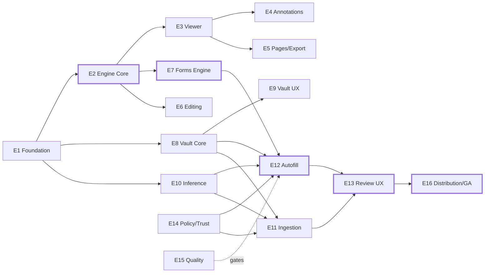

# Engineering Roadmap

## Vaultform — MVP + Post-GA Horizons

| | |
|---|---|
| **Version** | 1.1 (Draft) |
| **Companion docs** | [PRD.md](PRD.md) · [ARCHITECTURE.md](ARCHITECTURE.md) |
| **Execution model** | Claude Code agents working `tasks/backlog/` across 4 parallel tracks. There are **no calendar dates in this plan**: wall-clock time is a function of concurrent agents and review throughput. Sequencing is governed entirely by dependencies, freeze points, and milestone gates. |

---

## 1. Structure of This Roadmap

- **Epics (E1–E16):** long-lived bodies of work mapped 1:1 to architecture modules, so ownership and merge surfaces stay disjoint.
- **Features:** shippable slices within an epic (each decomposes further into agent-sized tasks in `tasks/backlog/`).
- **Milestones (M0–M6):** integration checkpoints with demo-able, testable exit criteria.
- **Phases (0–3):** dependency waves — a phase's work becomes available when its entry criteria (freeze points/milestones) land, never on a date; tracks enter the next wave independently.

---

## 2. Epics

### Track A — Editor (the install-earner)
| Epic | Scope | PRD refs |
|---|---|---|
| **E2 PDF Engine Core** | PDFium integration, DocEngine.xpc, parse/render/tiling, atomic save + backups, text extraction | FR-1.1, NFR-R2, ADR-001 |
| **E3 Viewer Experience** | Scroll/zoom, thumbnails, outline, search, tabs, multi-window, shortcuts | FR-1.2, FR-6.1 |
| **E4 Annotations & Signatures** | Full standard annotation set; signature create/store/place/flatten | FR-1.3, FR-1.6 |
| **E5 Page Management & Export** | Page ops, merge/split; export flatten/images/text, compression | FR-1.5, FR-1.11 |
| **E6 Content Editing** | Text-block editing w/ font matching, image ops | FR-1.4 |
| **E7 Forms Engine** | AcroForm model read/write, fill UI, widgets, tab order | FR-1.8 |

### Track B — Vault (the trust core)
| Epic | Scope | PRD refs |
|---|---|---|
| **E8 Vault Core** | Vault.xpc, SQLCipher store, key hierarchy, lock/auth, CRUD, provenance, history lists, crypto-shred | FR-2.*, NFR-S1 |
| **E9 Vault Experience** | Profile manager UI, multi-person + relationships, sensitivity masking, manual entry | FR-2.1–2.5 |

### Track C — Intelligence (the payment-earner)
| Epic | Scope | PRD refs |
|---|---|---|
| **E10 Inference Platform** | Inference.xpc, model registry, OCR/classify/NER/embed/generate endpoints, model packs, hardware tiers | FR-1.7, §7 arch |
| **E11 Ingestion Pipeline** | Stage graph, extractors (MRZ, PDF417, resume NER, filled-form reader), conflict detection, review session | FR-3.* |
| **E12 Autofill Engine** | Field discovery, matching ladder, ValueFormatter, FillPlanner, FormKnowledge, flat-form beta path | FR-4.* |
| **E13 Review UX** | Autofill review panel, ingestion review UI, profile selection, needs-input flow | FR-3.4, FR-4.4–4.7 |

### Track D — Platform & Trust (the credibility)
| Epic | Scope | PRD refs |
|---|---|---|
| **E1 Platform Foundation** | Repo, SPM workspace, CI, XPC transport layer, DTO conventions, PolicyKit + VaultModel packages | §3 arch |
| **E14 Policy, Trust & Privacy** | PolicyKit rules, sensitive gating, audit log, privacy dashboard, network-audit gate | FR-5.*, NFR-A4 |
| **E15 Quality & Benchmarks** | Fixtures corpus, top-100 forms benchmark, 10K round-trip suite, perf harness, accuracy CI gates | NFR-A*, gates §8 PRD |
| **E16 Distribution & Monetization** | MAS + Sparkle notarized builds, StoreKit/licensing, free-tier limits, onboarding, opt-in telemetry | §8 PRD, R11 |

---

## 3. Phases & Milestones

| Phase | Entry criteria | Milestones | Theme |
|---|---|---|---|
| **Phase 0 — Foundation** | None — starts immediately | M0 | De-risk the two bets: PDFium editing viability, XPC topology latency |
| **Phase 1 — Core Pillars** | M0 freeze points landed | M1, M2 | Viewer to Preview-parity; vault alpha; inference platform online |
| **Phase 2 — Intelligence** | Per-track: each track enters as its Phase 1 contracts freeze (no phase-wide gate) | M3, M4 | AcroForm autofill end-to-end; ingestion alpha; editing + forms |
| **Phase 3 — Beta → GA** | M3 + M4 | M5, M6 | Flat-form beta, trust surface, monetization, hardening, GA gates |

### Milestone exit criteria

- **M0 — Skeleton:** App opens and renders PDFs via DocEngine.xpc at 60fps scroll on corpus sample; XPC render latency measured vs NFR-P2 (ADR-002 checkpoint); PDFium text-edit spike memo accepted (ADR-001 gate #1); CI green with boundary lint.
- **M1 — Preview Parity:** Viewer + full annotations + page ops + search + tabs; round-trips annotations with Acrobat/Preview; 0 corruption on corpus suite v1.
- **M2 — Vault Alpha:** Encrypted vault behind Touch ID; multi-profile manual entry with history lists; crypto-shred works; security self-review complete.
- **M3 — First Fill:** W-9 + DS-160-class AcroForm autofilled end-to-end from vault via review panel; NFR-A1 ≥ 90% on dictionary set (interim bar); sensitive gating enforced.
- **M4 — Ingestion Alpha:** Passport/license/resume/filled-form → review → vault; MRZ extraction ≥ 99% on fixture set; conflict flow usable.
- **M5 — Private Beta:** Flat-form fill (beta-labeled), privacy dashboard, licensing + free tier, onboarding; 25-user beta launched; packet-capture audit clean.
- **M6 — GA:** All four PRD §8 acceptance gates pass; accessibility pass; both distribution channels notarized and shipping.

### Execution waves (dependency-paced, not calendar-paced)

All work is executed by Claude Code agents pulling from `tasks/backlog/`. Throughput scales with the number of concurrent agents; the only fixed structure is the *order* below. A wave's tasks run in parallel wherever their primary packages are disjoint (see tasks/README.md conflict rules).

| Wave | Unblocked work (⟂ = parallel) | Gate to the next wave |
|---|---|---|
| **0** | P0-01 → P0-02, then P0-03…P0-10 largely ⟂ (scaffold and CI first; API/freeze-point packages, PDFium, transport, render, fixtures fan out) | **M0** — freeze points landed + engine spike memo accepted |
| **1** | Four tracks fan out fully: viewer P1-01…07 ⟂ vault P1-08…11 ⟂ inference P1-12…14 ⟂ trust/save P1-15,16 | Per-track exits: **M1** (editor), **M2** (vault), Inference endpoints freeze (with P1-12) |
| **2** | Forms P2-01,02 ⟂ autofill core P2-03…07 ⟂ ingestion P2-08…11 ⟂ editing/signatures/export P2-13…16 ⟂ FormKnowledge P2-12 | **M3** (first fill) + **M4** (ingestion alpha); ADR-001 gate memo at P2-14 |
| **3** | Flat-form beta P3-01,02 ⟂ trust surface P3-03,04 ⟂ monetization/distribution P3-05,06 ⟂ UX/accessibility/telemetry P3-07…09 | **M5** (private beta) → P3-10 burn-down (feature freeze) → **M6** (GA) |

---

## 4. Dependency Graph & Critical Path

**Critical path (bold): E1 → E2 → E7 → E12 → E13 → E16.** The engine and forms subsystem gate the flagship feature; everything on this path gets first claim on staffing and unblocking. Slips here move GA; slips elsewhere eat parallel slack.

**Key dependency explanations:**
- **E2 gates almost everything in Track A** — but only its *API surface* (PDFEngineAPI protocols, Phase 0) gates other teams; implementations evolve behind frozen protocols. This is the single most important conflict-avoidance move.
- **E12 Autofill needs three inputs:** FormModel (E7), vault reads (E8), embeddings/LLM (E10). All three expose protocol-level contracts during Phase 0/1 freezes, so E12 development starts against fakes as soon as those contracts land and swaps in real services when they ship.
- **E14 PolicyKit must precede any vault-consuming feature** — the PolicyTicket API lands in Phase 0 precisely so autofill/ingestion are never built with a bypass "temporarily."
- **E15 runs the whole project** — the benchmark corpus is *Phase 0* work because model and matcher quality (NFR-A1–A4) cannot be assessed retroactively, and it is the ADR-001/R2 evidence base.
- **E16 is last but not late** — sandbox-compatible design is enforced from day 1 (R11); the epic itself is packaging, licensing, onboarding.

---

## 5. Parallelization Plan

**Runs in parallel once M0 lands:**
- Track A viewer/annotations ⟂ Track B vault ⟂ Track C inference platform ⟂ Track D audit/quality — zero shared files (separate SPM packages, separate XPC services).

**Runs in parallel within tracks:**
- E4 annotations ⟂ E5 page ops (different engine API surfaces).
- E11 ingestion ⟂ E12 autofill after E10 endpoints exist (share only Inference client API).
- Individual extractors (MRZ, PDF417, resume NER) are embarrassingly parallel.

**Deliberately serialized:**
- E6 content editing *after* M1 — hardest engine work, needs render/save maturity, and it's the ADR-001 fallback decision point: if text editing misses its checkpoint (the P2-14 gate memo), trigger the commercial-SDK escape hatch for the editing layer only.
- E13 review UX after E12/E11 produce real proposal streams — building review UI against fakes twice is waste; a thin walking-skeleton panel ships with M3 instead.
- Flat-form visual detection (in E12) after AcroForm path proves the pipeline — R2 mitigation ordering.

**Contract freeze points (what makes the parallelism safe):**
| Freeze | When | Consumers unblocked |
|---|---|---|
| PDFEngineAPI protocols v1 | M0 | Viewer, annotations, forms, autofill field discovery |
| XPC DTO conventions + transport | M0 | All services |
| VaultModel schema + PolicyTicket API | M0 | Vault impl, autofill, ingestion, policy |
| Inference typed endpoints v1 | with P1-12 | Autofill matcher, ingestion extractors |
| FormModel (typed field tree) v1 | with P2-01 | Fill UI, autofill, FormKnowledge |

---

## 6. Post-GA Horizons (from PRD §9, epic-level only)

| Horizon | Epics |
|---|---|
| H1 — first post-GA wave | Redaction & metadata scrub; local learning loop + fill memory GA; field creation/flat-to-fillable; Word/PDF-A export; ephemeral mode; Shortcuts/Services; localization wave 1 |
| H2 — after H1 | Doc Q&A (local LLM); NL fill instructions; history timelines UX; comparison/Bates; E2E iCloud sync foundation |
| H3 — long horizon, decision-gated | iOS companion; opt-in cloud tier; team edition; template marketplace; ExtensionKit plugins |

---

## 7. Top Execution Risks in the Plan Itself

1. **PDFium editing spike is the plan's fuse** — resolved by the M0 memo + the ADR-001 gate at the P2-14 checkpoint, with a priced commercial fallback.
2. **One integration milestone (M3) depends on three tracks converging** — mitigated by contract freezes + fakes; M3 scoped to *one* golden-path form class first.
3. **Benchmark corpus is on the critical path for *quality* though not for *code*** — started in Wave 0 (P0-08); form acquisition is the one activity agents can't fully self-serve (licensing of government forms is trivial; medical/HR packets need collection effort) — this is the main human-in-the-loop dependency.
